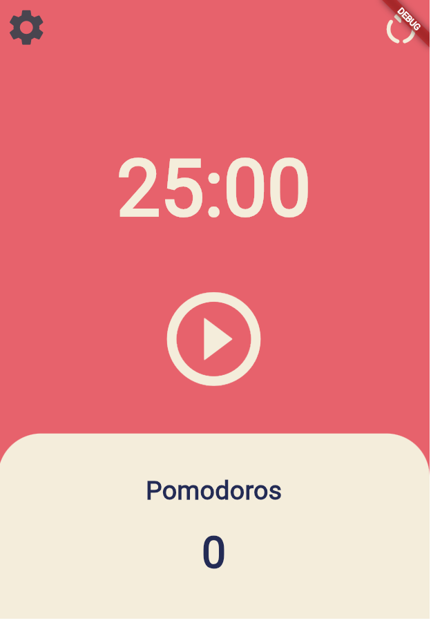

# Flutter Pomodoro App

A simple and elegant Pomodoro timer app built with Flutter to help you manage your time effectively using the Pomodoro technique. The app allows you to start, pause, and restart a timer, and also customize the duration of each Pomodoro session.

## Table of Contents

1. [Overview](#overview)
2. [Features](#features)
3. [Screenshots](#screenshots)
4. [Installation](#installation)
5. [Usage](#usage)
6. [Project Structure](#project-structure)
7. [Contact](#contact)

## Overview

The Pomodoro technique is a time management method that breaks work into intervals, traditionally 25 minutes in length, separated by short breaks. This app allows you to:

- Start and pause the timer.
- Restart the timer and track the number of Pomodoros completed.
- Set custom durations for your Pomodoro sessions.

## Features

- **Customizable Timer**: Set your own focus time and short break intervals.
- **Simple UI**: Minimalist design to keep you focused on your tasks.
- **Restart Confirmation**: A confirmation dialog ensures that you don’t accidentally restart the timer.

## Screenshots

<div style="display: flex; justify-content: space-around;">
    <div style="text-align: center;">
        
        <p>Home Screen</p>
    </div>
    <div style="text-align: center;">
        
        <p>Timer Settings</p>
    </div>
    <div style="text-align: center;">
        
        <p>After Setting</p>
    </div>
</div>

## Installation

1. Clone the repository:

    ```bash
    git clone https://github.com/minhosong88/flutter_Pomodoro_app.git
    ```

2. Navigate to the project directory:

    ```bash
    cd flutter_Pomodoro_app
    ```

3. Install the dependencies:

    ```bash
    flutter pub get
    ```

4. Run the app:

    ```bash
    flutter run
    ```

## Usage

- **Start Timer**: Press the play button to start the Pomodoro timer.
- **Pause Timer**: Press the pause button to pause the timer.
- **Restart Timer**: Press the restart button to reset the timer and Pomodoro count. A dialog will ask for confirmation before restarting.
- **Set Timer**: Go to the settings (gear icon) to customize the Pomodoro duration.

## Project Structure

```plaintext
lib/
│
├── main.dart               # Entry point of the application
│
├── screens/                # Directory for screen files
│   ├── home_screen.dart    # Home screen of the app
│   └── timer_setting_screen.dart  # Timer setting screen
│
└── widgets/                # Directory for widget files
    └── show_dialog.dart    # Widget for the restart confirmation dialog
```

## Contact
For any questions or inquiries, feel free to reach out:

* GitHub: minhosong88
* Email: [hominsong@naver.com]

#### Thank you for checking out this project! If you found it helpful, consider giving it a star on GitHub.

